# FLUXOS.md — App Veículos Mobile

_Diagramas Mermaid dos fluxos principais._

_Última atualização: 30/05/2026_

---

## App — visão geral

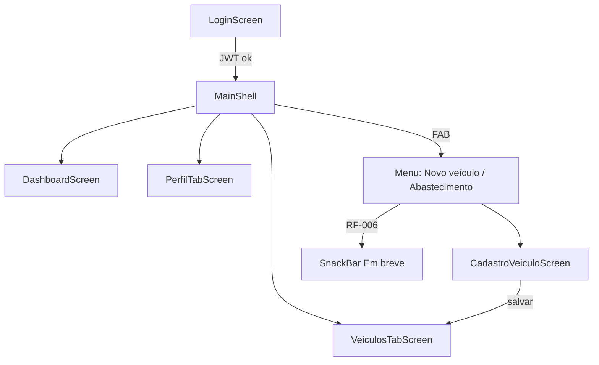

## RF-001 — Login

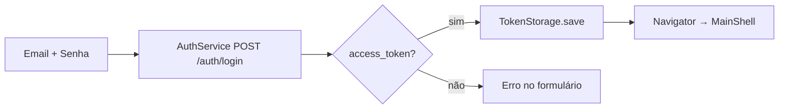

## RF-002 — Dashboard

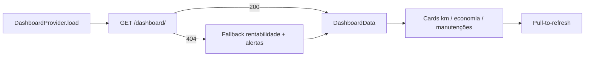

## RF-003 / RF-003b — Lista + Swipe

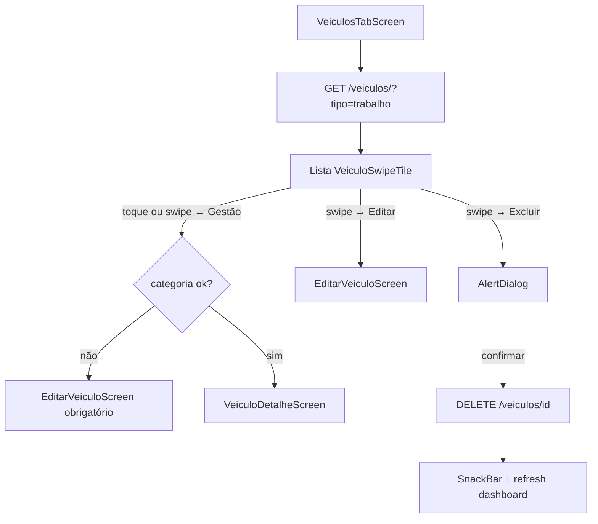

## RF-004 — Cadastro

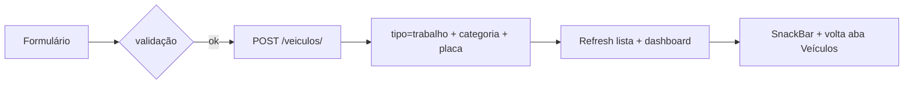

## RF-004b / RF-004c — Categoria

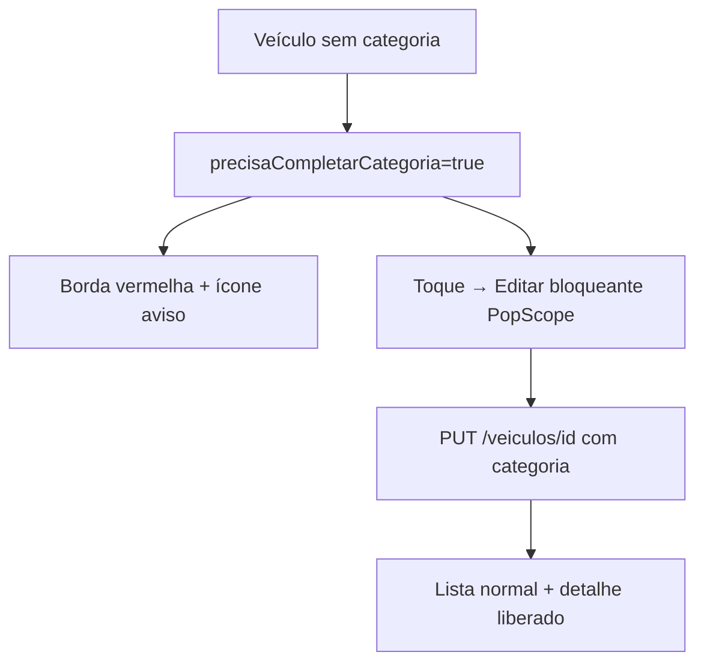

## RF-005 — Detalhe com abas

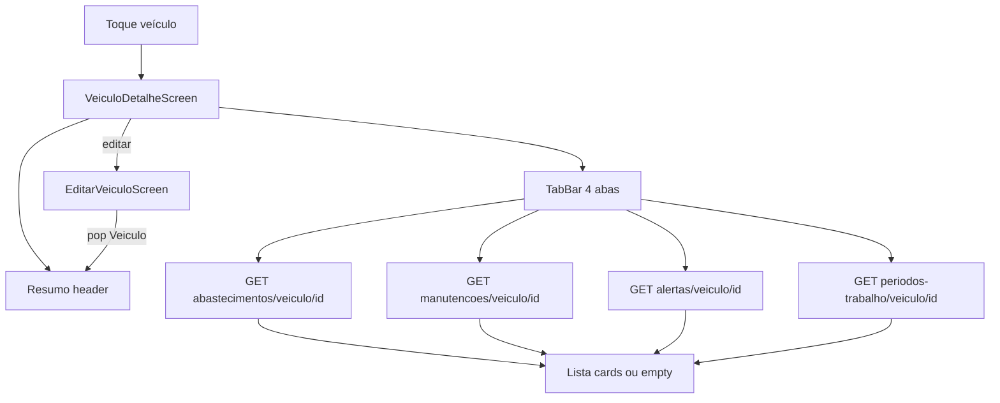

## RF-007 — Manutenções CRUD

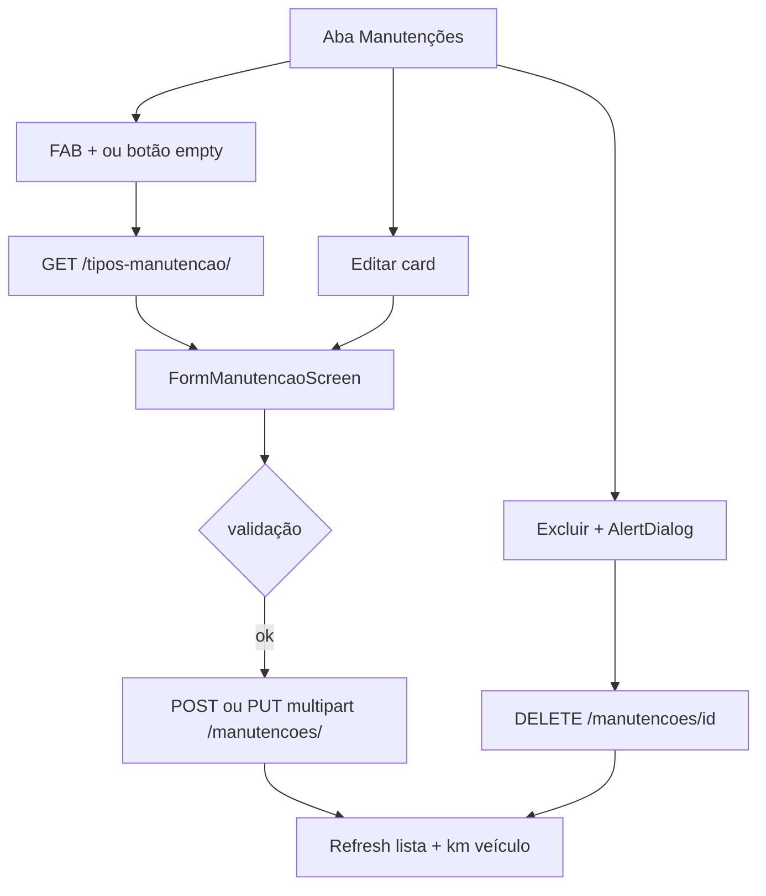

## RF-008 — Alertas CRUD + ciclo de vida (badge / notificação)

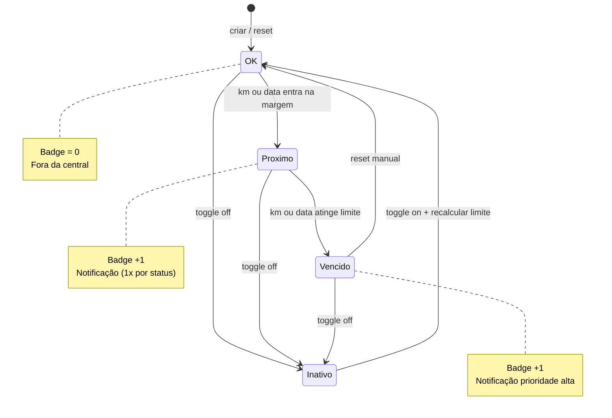

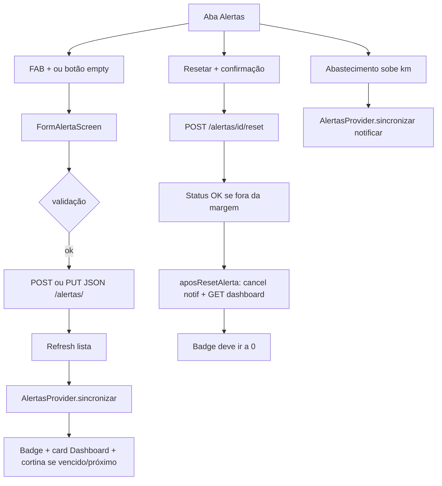

## RF-009 — Turnos de trabalho + ganhos

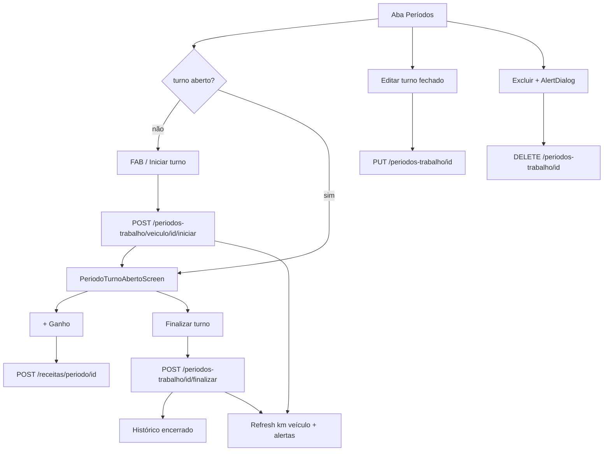

## RF-008 — Alertas CRUD (legado resumido)

## MainShell — Bottom Bar + FAB

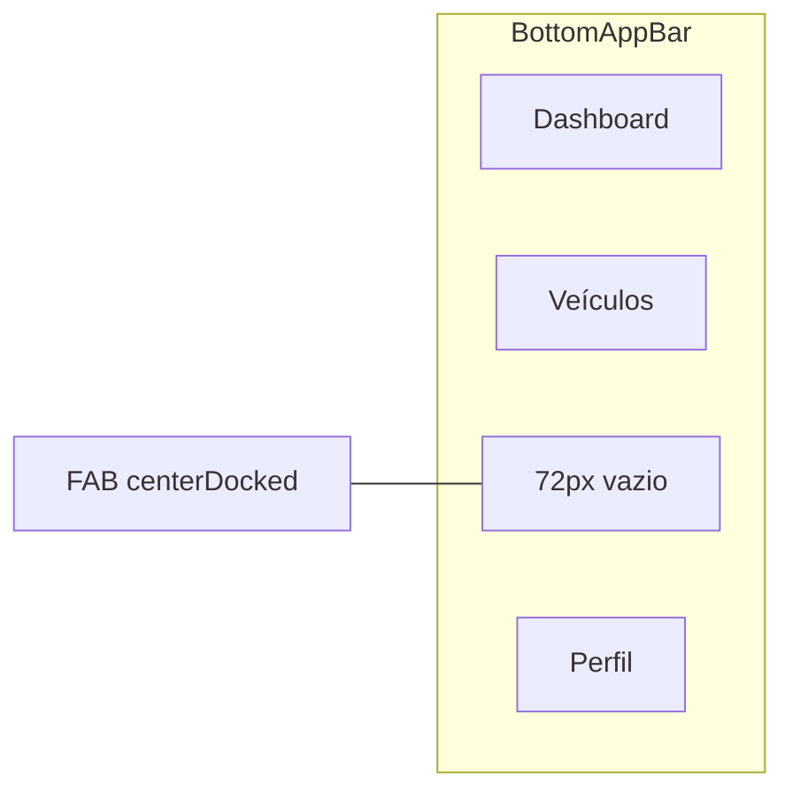

## Navegação secundária (stack)

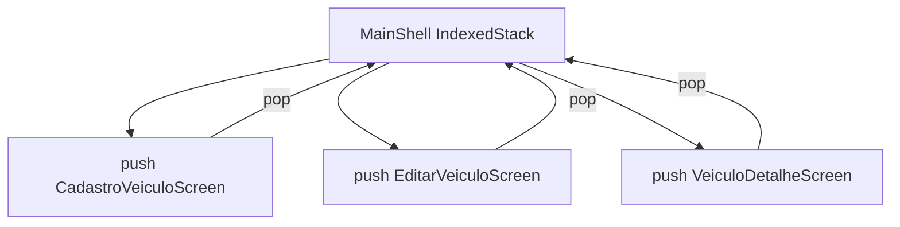
